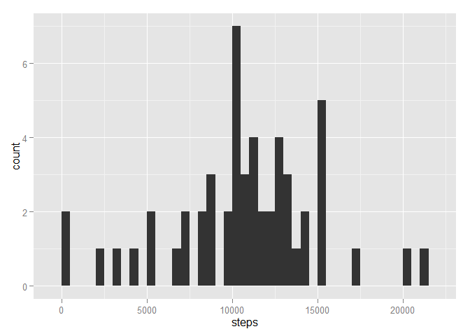

# Reproducible Research: Peer Assessment 1


Load packages required to execute.  
Installation of packages commented out since only needed to execute once.

```r
##install.packages("dplyr")
##install.packages("reshape")
##install.packages("ggplot2")
library(dplyr)
```

```
## 
## Attaching package: 'dplyr'
## 
## The following object is masked from 'package:stats':
## 
##     filter
## 
## The following objects are masked from 'package:base':
## 
##     intersect, setdiff, setequal, union
```

```r
library(reshape)
```

```
## 
## Attaching package: 'reshape'
## 
## The following object is masked from 'package:dplyr':
## 
##     rename
```

```r
library(ggplot2)
```

## Loading and preprocessing the data  
Code below could be upgraded to download zip file and read contents.  

```r
setwd("H:/2015/coursera/data_science/reproducible_research/peer_assignment_1")
activitydf <- read.csv("activity.csv", header = TRUE, stringsAsFactors=FALSE)
```


## What is mean total number of steps taken per day?  
1. Calculate the total number of steps taken per day  

```r
stepsvsdate <- aggregate(steps ~ date, data=activitydf, sum)
```
2. Make a histogram of the total number of steps taken each day  

```r
ggplot(stepsvsdate, aes(x=steps)) + geom_histogram(binwidth=500)
```

 
  
3. Calculate and report the mean and median of the total number of steps taken per day.  

```r
mean(stepsvsdate$steps)
```

```
## [1] 10766.19
```

```r
median(stepsvsdate$steps)
```

```
## [1] 10765
```


## What is the average daily activity pattern?
1. Make a time series plot (i.e. type = "l") of the 5-minute interval (x-axis) and the average number of steps taken, averaged across all days (y-axis)  
  
  First aggregate the data to enable the desired plot.  

```r
stepsvsinterval <- aggregate(steps ~ interval, data=activitydf, mean)
```
  
Now plot the aggregated data.  

```r
plot(stepsvsinterval$interval, stepsvsinterval$steps, type="l", main="Time series", xlab="Interval", ylab="# of steps per Interval")
```

 
  
2. Which 5-minute interval, on average across all the days in the dataset, contains the maximum number of steps?  

```r
which.max(stepsvsinterval$steps)
```

```
## [1] 104
```

## Imputing missing values
1. Calculate and report the total number of missing values in the dataset (i.e. the total number of rows with NAs)  

```r
sum(is.na(activitydf$steps))
```

```
## [1] 2304
```
2. Devise a strategy for filling in all of the missing values in the dataset.  

Replace NA values with mean across all non-NA values from same interval.  

3. Create a new dataset that is equal to the original dataset but with the missing data filled in.  

```r
meanstepsvsinterval <- aggregate(steps ~ interval, data=activitydf, mean)
activitydfnew <- activitydf
isnasteps <- is.na(activitydfnew$steps)
for (i in 1:length(isnasteps)) {
    interval <- activitydfnew[i,"interval"]
	position <- match(interval, meanstepsvsinterval$interval)
	if(isnasteps[i]) { 
	    activitydfnew[i,"steps"] <- meanstepsvsinterval$steps[position] 
	}
}
```
Brief test to demonstrate missing values are now zero.  

```r
sum(is.na(activitydfnew$steps))
```

```
## [1] 0
```

4. Make a histogram of the total number of steps taken each day.  
As per previous plot, aggregate the data first, then plot.  

```r
stepsvsdatenew <- aggregate(steps ~ date, data=activitydfnew, sum)
ggplot(stepsvsdatenew, aes(x=steps)) + geom_histogram(binwidth=500)
```

 
  
4a. Calculate and report the mean and median total number of steps taken per day.  

```r
mean(stepsvsdatenew$steps)
```

```
## [1] 10766.19
```

```r
median(stepsvsdatenew$steps)
```

```
## [1] 10766.19
```
The mean and median being exactly the same was not expected, a product of the statistical distribution.  

4b. Do these values differ from the estimates from the first part of the assignment?  
Only a small difference exists between the before and after mean and median values.  

```r
mean(stepsvsdatenew$steps) - mean(stepsvsdate$steps)
```

```
## [1] 0
```

```r
median(stepsvsdatenew$steps) - median(stepsvsdate$steps)
```

```
## [1] 1.188679
```


4c. What is the impact of imputing missing data on the estimates of the total daily number of steps?  


```r
sum(stepsvsdate$steps)
```

```
## [1] 570608
```

```r
sum(stepsvsdatenew$steps)
```

```
## [1] 656737.5
```

```r
sum(stepsvsdatenew$steps) - sum(stepsvsdate$steps)  
```

```
## [1] 86129.51
```
  
As expected, filling in the missing values with average values from the same time periods, results in the total daily number of steps increasing.  As the numbers above demonstrate, an increase in the total daily number of steps was observed.  


## Are there differences in activity patterns between weekdays and weekends?
1. Create a new factor variable in the dataset with two levels – 'weekday' and 'weekend' indicating whether a given date is a weekday or weekend day.  

```r
weekendDays <- c("Saturday", "Sunday")
for (i in 1:length(activitydfnew$date)) {
    if(weekdays(as.Date(activitydfnew$date[i])) %in% weekendDays) {
	    activitydfnew$isWeekEnd[i] = "weekend"
    } else {
        activitydfnew$isWeekEnd[i] = "weekday"
	}
}
activitydfnew$isWeekEnd <- factor(activitydfnew$isWeekEnd)
```
  
2. Make a panel plot containing a time series plot (i.e. type = "l") of the 5-minute interval (x-axis) and the average number of steps taken, averaged across all weekday days or weekend days (y-axis).

```r
ggplot(activitydfnew, aes(interval, steps)) + geom_line()+facet_grid(isWeekEnd~.)
```

 
  
The plot of activity patterns steps vs time of day (interval) show that weekend activity starts markedly later in the day than weekdays. There is a sharper reduction in activity at night on weekends (after 8:30pm) than during weekdays.
